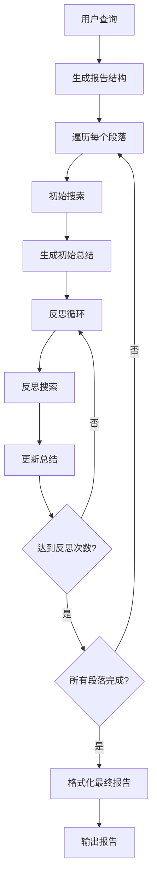
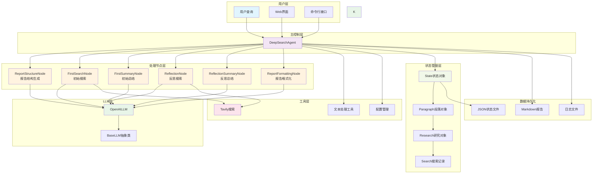

# Deep Search Agent

[](https://python.org)
[](LICENSE)
[](https://platform.openai.com/)
[](https://tavily.com/)

一个**无框架**的深度搜索AI代理实现，能够通过多轮搜索和反思生成高质量的研究报告。


## 特性

- **无框架设计**: 从零实现，不依赖LangChain等重型框架
- **OpenAI支持**: 使用 OpenAI 主流模型，可擴充至其他 LLM
- **智能搜索**: 集成Tavily搜索引擎，提供高质量网络搜索
- **反思机制**: 多轮反思优化，确保研究深度和完整性
- **状态管理**: 完整的研究过程状态跟踪和恢复
- **Web界面**: Streamlit友好界面，易于使用
- **Markdown输出**: 美观的Markdown格式研究报告

## 工作原理

Deep Search Agent采用分阶段的研究方法：



### 核心流程

1. **结构生成**: 根据查询生成报告大纲和段落结构
2. **初始研究**: 为每个段落生成搜索查询并获取相关信息
3. **初始总结**: 基于搜索结果生成段落初稿
4. **反思优化**: 多轮反思，发现遗漏并补充搜索
5. **最终整合**: 将所有段落整合为完整的Markdown报告

## 快速开始

### 1. 环境准备

确保您的系统安装了Python 3.9或更高版本：

```bash
python --version
```

### 2. 克隆项目

```bash
git clone <your-repo-url>
cd Demo\ DeepSearch\ Agent
```

### 3. 安装依赖

```bash
# 激活虚拟环境（推荐）
conda activate pytorch_python11  # 或者使用其他虚拟环境

# 安装依赖
pip install -r requirements.txt
```

### 4. 配置API密钥

設定分成兩個檔：

**`.env`**（API key，gitignored）— 複製 `.env.example` 後填入：

```bash
cp .env.example .env
```

```
OPENAI_API_KEY=your_openai_api_key_here
TAVILY_API_KEY=your_tavily_api_key_here
```

**`config.py`**（非機密設定，已在 git）— 直接編輯：

```python
DEFAULT_LLM_PROVIDER = "openai"
OPENAI_MODEL = "gpt-4o-mini"

MAX_REFLECTIONS = 2
SEARCH_RESULTS_PER_QUERY = 3
SEARCH_CONTENT_MAX_LENGTH = 20000
OUTPUT_DIR = "reports"
SAVE_INTERMEDIATE_STATES = True
```

### 5. 开始使用

现在您可以开始使用Deep Search Agent了！

## 使用方法

### 方式一：运行示例脚本

**基本使用示例**：
```bash
python examples/basic_usage.py
```
这个示例展示了最简单的使用方式，执行一个预设的研究查询并显示结果。

**高级使用示例**：
```bash
python examples/advanced_usage.py
```
这个示例展示了更复杂的使用场景，包括：
- 自定义配置参数
- 执行多个研究任务
- 状态管理和恢复
- 不同模型的使用

### 方式二：Web界面

启动Streamlit Web界面：
```bash
streamlit run examples/streamlit_app.py
```
Web界面无需配置文件，直接在界面中输入API密钥即可使用。

### 方式三：编程方式

```python
from src import DeepSearchAgent, load_config

# 加载配置
config = load_config()

# 创建Agent
agent = DeepSearchAgent(config)

# 执行研究
query = "2025年人工智能发展趋势"
final_report = agent.research(query, save_report=True)

print(final_report)
```

### 方式四：自定义配置（编程方式）

如果需要在代码中动态设置配置，可以使用以下方式：

```python
from src import DeepSearchAgent, Config

# 自定义配置
config = Config(
    default_llm_provider="openai",
    openai_model="gpt-4o-mini",
    max_reflections=3,           # 增加反思次数
    max_search_results=5,        # 增加搜索结果数
    output_dir="my_reports"      # 自定义输出目录
)

# 设置API密钥
config.openai_api_key = "your_api_key"
config.tavily_api_key = "your_tavily_key"

agent = DeepSearchAgent(config)
```

## 项目结构

```
Demo DeepSearch Agent/
├── src/                          # 核心代码
│   ├── llms/                     # LLM调用模块
│   │   ├── base.py              # LLM基类
│   │   └── openai_llm.py        # OpenAI实现
│   ├── nodes/                    # 处理节点
│   │   ├── base_node.py         # 节点基类
│   │   ├── report_structure_node.py  # 结构生成
│   │   ├── search_node.py       # 搜索节点
│   │   ├── summary_node.py      # 总结节点
│   │   └── formatting_node.py   # 格式化节点
│   ├── prompts/                  # 提示词模块
│   │   └── prompts.py           # 所有提示词定义
│   ├── state/                    # 状态管理
│   │   └── state.py             # 状态数据结构
│   ├── tools/                    # 工具调用
│   │   └── search.py            # 搜索工具
│   ├── utils/                    # 工具函数
│   │   ├── config.py            # 配置管理
│   │   └── text_processing.py   # 文本处理
│   └── agent.py                 # 主Agent类
├── examples/                     # 使用示例
│   ├── basic_usage.py           # 基本使用示例
│   ├── advanced_usage.py        # 高级使用示例
│   └── streamlit_app.py         # Web界面
├── reports/                      # 输出报告目录
├── requirements.txt              # 依赖列表
├── config.py                    # 配置文件
└── README.md                    # 项目文档
```

## 代码结构



## API 参考

### DeepSearchAgent

主要的Agent类，提供完整的深度搜索功能。

```python
class DeepSearchAgent:
    def __init__(self, config: Optional[Config] = None)
    def research(self, query: str, save_report: bool = True) -> str
    def get_progress_summary(self) -> Dict[str, Any]
    def load_state(self, filepath: str)
    def save_state(self, filepath: str)
```

### Config

配置管理类，控制Agent的行为参数。

```python
class Config:
    # API密钥
    openai_api_key: Optional[str]
    tavily_api_key: Optional[str]

    # 模型配置
    default_llm_provider: str = "openai"
    openai_model: str = "gpt-4o-mini"
    
    # 搜索配置
    max_search_results: int = 3
    search_timeout: int = 240
    max_content_length: int = 20000
    
    # Agent配置
    max_reflections: int = 2
    max_paragraphs: int = 5
```

## 示例

### 示例1：基本研究

```python
from src import create_agent

# 快速创建Agent
agent = create_agent()

# 执行研究
report = agent.research("量子计算的发展现状")
print(report)
```

### 示例2：自定义研究参数

```python
from src import DeepSearchAgent, Config

config = Config(
    max_reflections=4,        # 更深度的反思
    max_search_results=8,     # 更多搜索结果
    max_paragraphs=6          # 更长的报告
)

agent = DeepSearchAgent(config)
report = agent.research("人工智能的伦理问题")
```

### 示例3：状态管理

```python
# 开始研究
agent = DeepSearchAgent()
report = agent.research("区块链技术应用")

# 保存状态
agent.save_state("blockchain_research.json")

# 稍后恢复状态
new_agent = DeepSearchAgent()
new_agent.load_state("blockchain_research.json")

# 检查进度
progress = new_agent.get_progress_summary()
print(f"研究进度: {progress['progress_percentage']}%")
```

## 高级功能

### 模型切換

```python
# OpenAI 預設使用 gpt-4o-mini，可切到 gpt-4o
config = Config(default_llm_provider="openai", openai_model="gpt-4o")
```

### 自定义输出

```python
config = Config(
    output_dir="custom_reports",           # 自定义输出目录
    save_intermediate_states=True          # 保存中间状态
)
```

## 常见问题

### Q: 支持哪些LLM？

A: 目前支持：
- **OpenAI**: GPT-4o、GPT-4o-mini 等
- 可以通过继承 `BaseLLM` 类（`src/llms/base.py`）添加其他模型

### Q: 如何获取API密钥？

A:
- **OpenAI**: 访问 [OpenAI平台](https://platform.openai.com/) 获取
- **Tavily**: 访问 [Tavily](https://tavily.com/) 注册获取（每月1000次免费）

獲取密鑰後，填入專案根目錄的 `.env` 即可（範本見 `.env.example`）。

### Q: 研究报告质量如何提升？

A: 可以通过以下方式优化：
- 增加`max_reflections`参数（更多反思轮次）
- 增加`max_search_results`参数（更多搜索结果）
- 调整`max_content_length`参数（更长的搜索内容）
- 使用更强大的LLM模型

### Q: 如何自定义提示词？

A: 修改`src/prompts/prompts.py`文件中的系统提示词，可以根据需要调整Agent的行为。

### Q: 支持其他搜索引擎吗？

A: 当前主要支持Tavily，但可以通过修改`src/tools/search.py`添加其他搜索引擎支持。

## 贡献

欢迎贡献代码！请遵循以下步骤：

1. Fork本项目
2. 创建特性分支 (`git checkout -b feature/AmazingFeature`)
3. 提交更改 (`git commit -m 'Add some AmazingFeature'`)
4. 推送到分支 (`git push origin feature/AmazingFeature`)
5. 开启Pull Request

## 许可证

本项目采用MIT许可证 - 查看 [LICENSE](LICENSE) 文件了解详情。

## 致谢

- 感谢 [OpenAI](https://openai.com/) 提供 LLM 服务
- 感谢 [Tavily](https://tavily.com/) 提供高质量的搜索API

---

如果这个项目对您有帮助，请给个Star！
